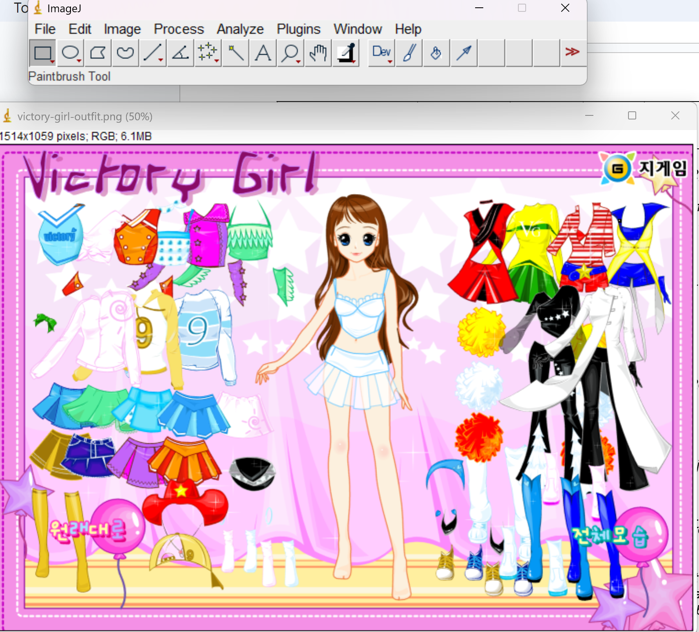

# Computational Method: Visualizing Games through ImagePlot

For this checkpoint, our group experimented with ImagePlot and see if there were any visual patterns between dress-up games from pre-2011, and dress-up games in post-2011. The resources we used were:
- ImagePlot, a macro that is included in ImageJ
    - ImageJ can be downloaded as a Zip file from [this website](https://imagej.net/ij/download.html)
- Images from the Flashpoint Archive (see [flashpoint-ss](/flashpoint-ss/))
    - Any images that did not have screenshots present in the archive were manually screenshotted, if its game was functional. Of our 20 games that were originally collected, the only game that we could not gather images for was "Cinderella Flies to Mexico"

## Documentation
To help with navigating the software, I followed some of the tutorials from an "ImagePlot Documentation" we had found online, linked here (https://docs.google.com/document/d/1zkeik0v2LJmi1TOK4OxT7dVKJO7oCmx_fNP8SYdTG-U/edit?hl=en_US&tab=t.0). The most releavnt & applicable parts of the PDF will be the "INSTALLING IMAGEPLOT", "RUNNING IMAGEPLOT", and "TUTORIAL: VISUALIZE AN IMAGE".

## The Process (it was rough)
After downloading the ImageJ zip file, unzipping, and running it, I was presented with a blank window. I was able to upload a singular image and mess around with some of the settings:

Originally, we attempted to

## Reflection
Some major issues that came with ImagePlot was the struggle to source documentation, as it was not readily available on the original GitHub repo. After some hunting, Thea and I found the original ImageJ website, with the download pages and documentation and everything (after hunting through several dead links from other copies of ImageJ documentation). 

After some searching through the documentation, we realized that the ImagePlot macro was no longer available in our ImageJ package, and could not be found in any of the macro folders. This meant that we could not use ImagePlot as we originally intended. Instead, I attempted to explore other tools within the macro library, such as 

